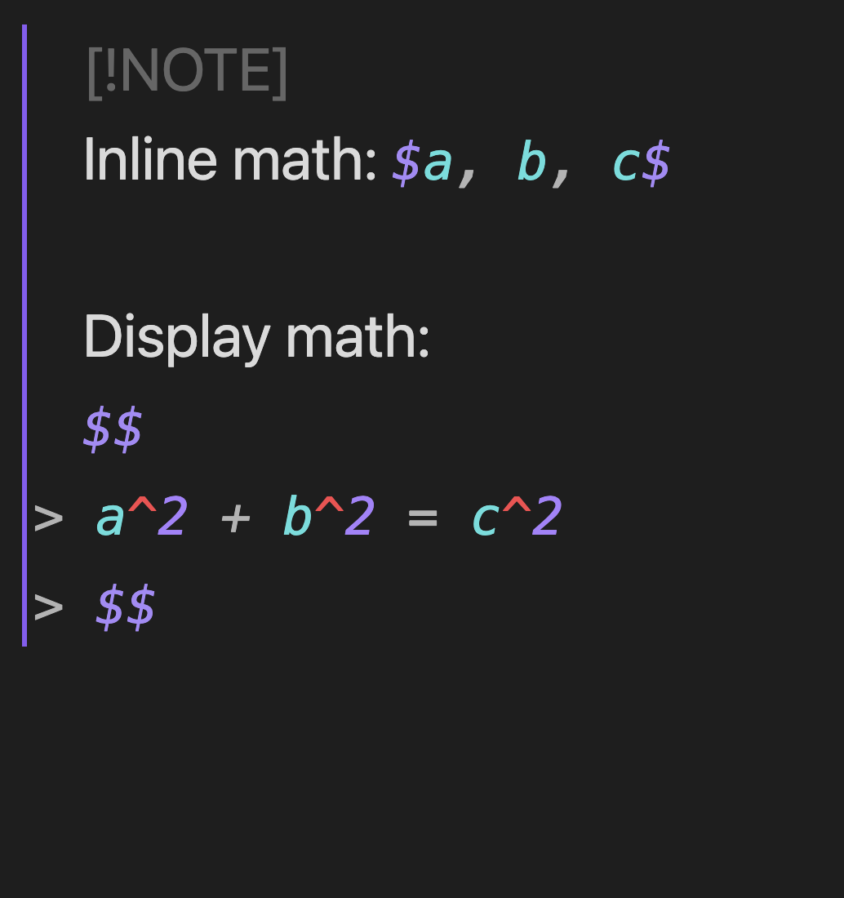
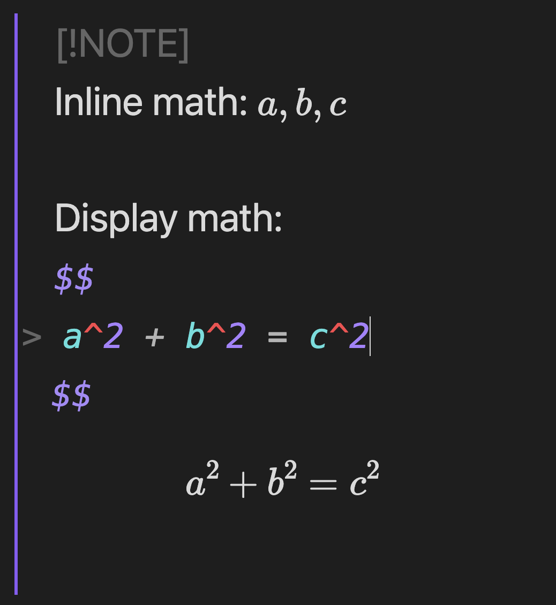
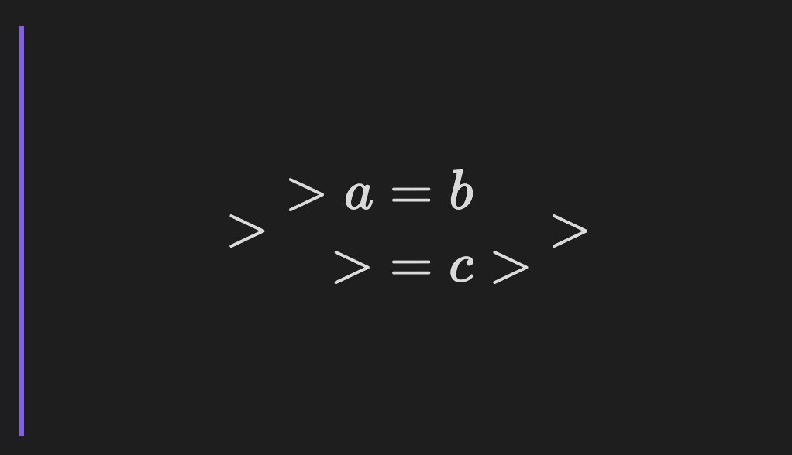
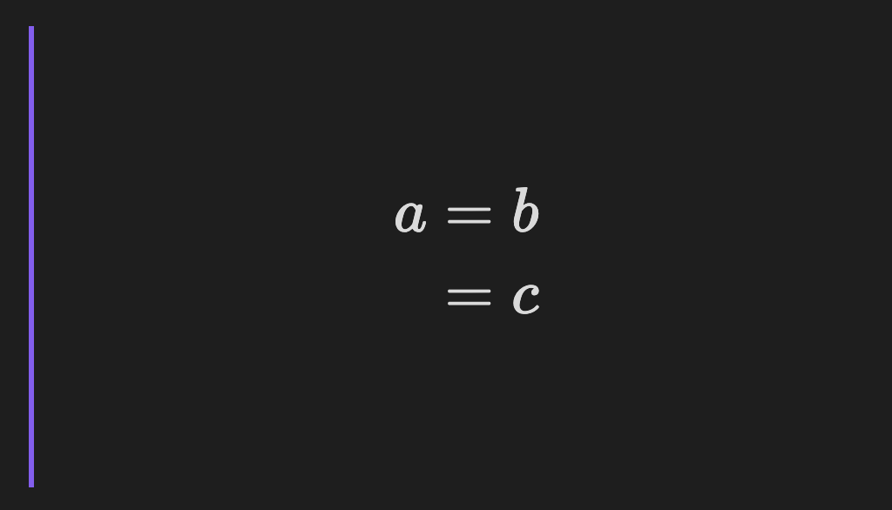

# Better Math in Callouts & Blockquotes

This is an [Obsidian.md](https://obsidian.md) plugin to add a better Live Preview support for math rendering inside callouts & blockquotes.

> Note: The feature of this plugin was originally a part of [Math Booster](https://ryotaushio.github.io/obsidian-math-booster/), another community plugin of mine. I completely rewrote it with a bunch of improvements, and decided to release it as a separate plugin for better modularity.
> 
> Once this plugin is approved by the Obsidian team, it will be removed from Math Booster.

## Features

### Math in Callouts

In Live Preview, the vanilla Obsidian does not render MathJax in callouts while editing them. 
This plugin solves this problem.

Moreover, it also enables proper handling of multi-line math blocks; see [the next section](math-in-lockquotes) below.

#### Example

 Without this plugin                 | With this plugin
:-----------------------------------:|:----------------------------------:
 | 

### Math in Blockquotes

In Live Preview, the vanilla Obsidian misunderstands a ">" symbol at the beginning of a line in a blockquote or a callout as an inequality sign ("greater than") in multi-line math blocks, while Reading View properly recognizes them. This plugin makes them consistent with Reading View. 

#### Example

```
> $$
> \begin{align}
> a &= b \\
>   &= c
> \end{align}
> $$
```

 Without this plugin                 | With this plugin
:-----------------------------------:|:----------------------------------:
 | 

## Installation

Since this plugin is still in beta, it's not on the community plugin browser yet.

But you can install the latest beta release using [BRAT](https://github.com/TfTHacker/obsidian42-brat):

1.  Install BRAT and enable it.
2.  Go to `Options`. In the `Beta Plugin List` section, click on the `Add Beta plugin` button.
3.  Copy and paste `RyotaUshio/obsidian-math-in-callout` in the pop-up prompt and click on **Add Plugin**.
4.  _(Optional but highly recommended)_ Turn on `Auto-update plugins at startup` at the top of the page.
5.  Go to `Community plugins > Installed plugins`. You will find “Better Math in Callouts & Blockquotes” in the list. Click on the toggle button to enable it.

## Companion plugins

Here's a list of other math-related plugins I've developed:

- [Math Booster](https://github.com/RyotaUshio/obsidian-math-booster)
- [No More Flickering Inline Math](https://github.com/RyotaUshio/obsidian-inline-math)
- [MathJax Preamble Manager](https://github.com/RyotaUshio/obsidian-mathjax-preamble-manager)
- [Auto-\\displaystyle Inline Math](https://github.com/RyotaUshio/obsidian-auto-displaystyle-inline-math)

## Support development

If you find this plugin useful, please support my work by buying me a coffee!

<a href="https://www.buymeacoffee.com/ryotaushio" target="_blank"></a>
